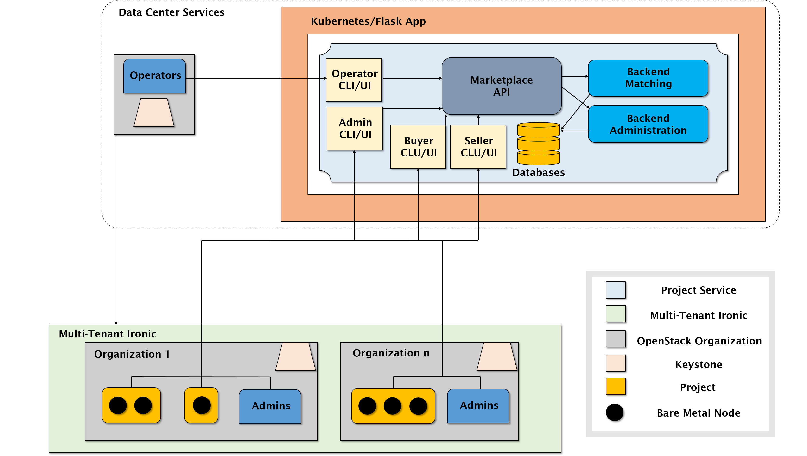

## A-Bare-Metal-Marketplace Project Description

#### By Parker Van Roy, Ayush Upneja, Manan Monga, Haoxuan Jia

#### Mentored by Sahil Tikale and Jonathan Chamberlain

### Context: 
* Many hosts do not use cloud servers due to multiple constraints including security, privacy, or a need for specific hardware. Hosts often rent space in a data center for their servers.

### Bare-Metal Marketplace: 
* In order to allow for scalability or temporarily increased resources and the opposite- productive use of unnecessary resources, a marketplace to buy and sell time on bare-metal nodes where a renter can use nodes for any purpose. 

### Project Goal: 
* Implementing an auction system in order to facilitate the fair economics of the bare-metal marketplace system.

### Reach Goals:
* Adding a system for filtering based on resource 
* Autobuy systems for HPC and temporary scaling purposes based on various criteria including cost per resource
* An enhanced UI

### Relevant Resources:
* [Project Github](https://github.com/BU-CLOUD-S21/A-Bare-Metal-Marketplace)
* [Original FLOCX Marketplace](https://github.com/CCI-MOC/flocx-market)
* [Forked FLOCX Marketplace](https://github.com/SahilTikale/flocx)
* [OpenStack Intro Docs](https://docs.openstack.org/security-guide/introduction/introduction-to-openstack.html)
* [Ironic Documentation](https://docs.openstack.org/ironic/latest/)
* [Multi-Tenant Ironic](https://docs.openstack.org/ironic/pike/admin/multitenancy.html)
* [MOC ESI](https://github.com/CCI-MOC/esi-leap)
* [KeyStone](https://docs.openstack.org/keystone/latest/) 
* [Bolted](https://www.usenix.org/system/files/atc19-mosayyebzadeh.pdf)

** **

## 1.   Vision and Goals Of The Project:

The vision of this project is an OpenStack service for data centers to implement an auction system for already written Bare Metal Marketplace technology in order to facilitate the rapid and secure trade of computing resources among DC tenants without physical interference. This tool has applications primarily in industry and in research contexts.

* Bare Metal Marketplace (BMM) will be a microservice in OpenStack which functions as a service auction for bare metal nodes.

High-Level goals of BMM include:
* Providing a simple straightforward user experience for non-expert users.
* Providing a command line interface (CLI) for streamlined access and implementation
* Enabling a direct P2P marketplace hosted by data centers.

## 2. Users/Personas Of The Project:

BMM will be used by clients who sell resources, and clients who buy nodes on our marketplace. 

* Shared Data Center Operators: (OPs) OpenStack users that are interested in hosting marketplace services to tenants that do not create security issues. In charge of currency system etc. but should not have inside information on tenant nodes, only trivial information on offered nodes.

* Hierarchy of Administrators: (Admins) Desire to control currency flow within hierarchy and assign roles/permissions to users below themselves in the hierarchy. May also be End Users.

* Selling End Users: (Sellers) Desire this application to reduce the cost of ownership for resources not always needed- may have different reasons or times/amounts etc. of resources to rent.
    * Type A- Wants to maximize money overall for a period of resource being rented
    * Type B- Wants to maximize money per amount of time that resource is being rented

* Buying End Users: (Buyers) Desire this application to obtain temporary additional resources from other tenants.
    * Type X- Desire this application to quickly scale (industry)
    * Type Y- Desire to run applications when cost-effective (HPC)
    
* Currency-Using Developers: (Devs) As currency systems are new to OpenStack, developing the system in a secure way that can be shared by multiple applications is a desired goal.

Note that it is important to keep in mind DC tenants have some rationale for choosing a DC over cloud solutions, including security or specific resource needs.

** **

## 3.   Scope and Features Of The Project:

The scope of this project is to design an auction system and related features- it is not to implement the core principles of the bare metal trading system. Included in this scope are UI elements related to the auction system, delivering information about nodes, selecting relevant resources based on cost, etc. Not included in this scope are cybersecurity aspects of bare metal access, delivery of the bare metal resource, etc.

* Hosting Tenants
    * Addition/Management of nodes
    * Authorization of who can sell
    * Flexible contested node policy
    * Multiple auction options
        * True auction
        * Buy now price set
    * Analytics portal
* Renting Tenants
    * Marketplace Filtering
    * Data management / Hard drive connection
* All Users
    * Messaging System
    * Profile Pages
    * Money Transfer / Credit System

** **

## 4. Solution Concept

Global Architectural Structure Of the Project:

Overall, this project aims to be implemented in OpenStack with the use of Ironic for bare-metal provisioning.

### Design Implications and Discussion:

* Tenant & Renter UI
    * React/Bootstrap for reusable components and pre-written CSS
* MongoDB- JSON like, popular and versatile
* Credential System- Reusing credentials in OpenStack and Ironic
* Nodes- Requiring BareMetal Hypervisor to be rented
* OpenStack-The desired service to make use of Ironic
* Ironic Plugins-Any necessary plugins such as the python agent
* Paypal- An easy external system to implement for payment transfer

The microservice itself needs to be light to run as to not consume unnecessary resources.

## 5. Acceptance criteria

Minimum Criteria would be a simple auction system that could serve as the BMM. Stretch Goals Include:
* An autobuy system for renters
* Analytics pages
* Content Filtering

## 6.  Release Planning:
Week 3 goals:
* Implement simplified auction system in Python + test cases
* Create tests for base Ironic built in functionality

Week 5 goals:
* Implement Bare Metal transfers with simplified auction system
* Create autobuy system structure
* Set up databases
* Create base CLI

Week 7 goals:
* Finishing Auction System
* Implement UI 
* Connected Databases
* Improve CLI for current functionality

Week 9 Goals:
* Full OpenStack Implementation
* Clean code/Refactor
* CLI/UI updates

Week 11 Goals:
* Autobuy and Content Filtering addition features

Week 13 Goals:
* Analytics / UI additional features + Profile features

** **

## General comments

#TODO all

** **
